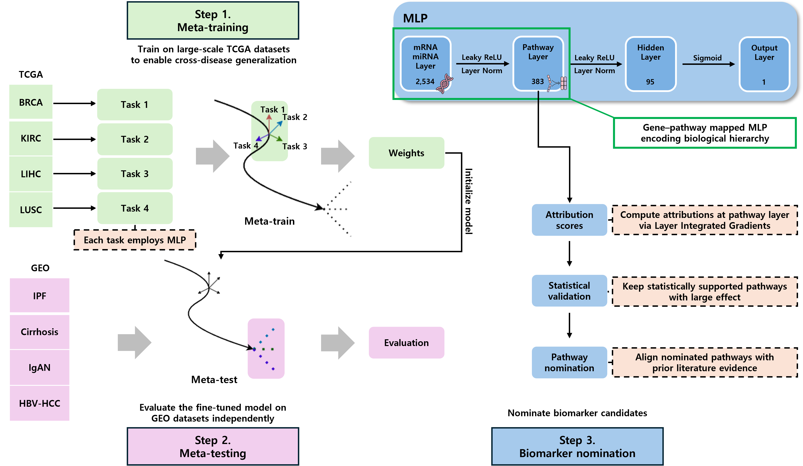

# PathwayMAML: Pathway-aware Meta-learning for Cancer-to-Non-Cancer Transfer

This repository provides the source code for **PathwayMAML**, a pathway-aware MAML framework for cancer-to-non-cancer transfer in few-shot multi-omics disease classification.

  

## Overview

PathwayMAML follows a three-stage pipeline:
1. **Meta-training** on multiple TCGA cancer tasks to learn a transferable initialization.
2. **Meta-testing / adaptation** to unseen GEO disease cohorts under *k*-shot supervision.
3. **Biomarker identification** by computing pathway-level attributions and performing cohort-level statistical testing.

The model takes **2,534 joint mRNA+miRNA features** as input and projects them into a **Reactome pathway layer (383 neurons)**
via a sparse gene→pathway mapping, followed by a **hidden layer (95 neurons)** and a binary output layer.
This design enables pathway-level interpretability by attributing predictions to pathway neurons (e.g., via Layer Integrated Gradients).
